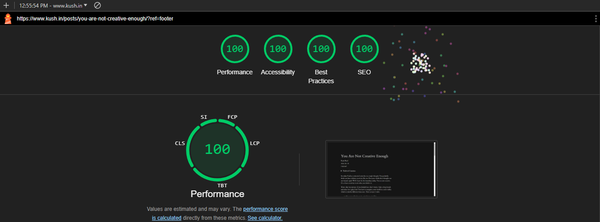

This is a fork of the [Tufte Hugo Theme](https://github.com/loikein/hugo-tufte). The project has been forked several times and this itself is a fork of the final iteration.

This fork adds the following new features:

- a dark theme as per OS settings using [prefers-color-scheme](https://developer.mozilla.org/en-US/docs/Web/CSS/@media/prefers-color-scheme) media feature.
- image processing capabilities to reduce image size and use optimized image format (WebP)
- lazy loading of images and iframes using [lazysizes](https://github.com/aFarkas/lazysizes)
- [mhchem](https://github.com/KaTeX/KaTeX/tree/main/contrib/mhchem) extension for KaTeX to render chemical expressions

The theme has also been heavily optimized for performance and accessibility.

## Usage

Please refer to the Hugo [documentation](https://gohugo.io/getting-started/quick-start/) for getting started with Hugo. You can configure Hugo to use this theme.

Use my [blog](https://github.com/libkush/blog) as an example for reference in configuration. Instructions are also provided on the [original repo](https://github.com/loikein/hugo-tufte) by the creator.